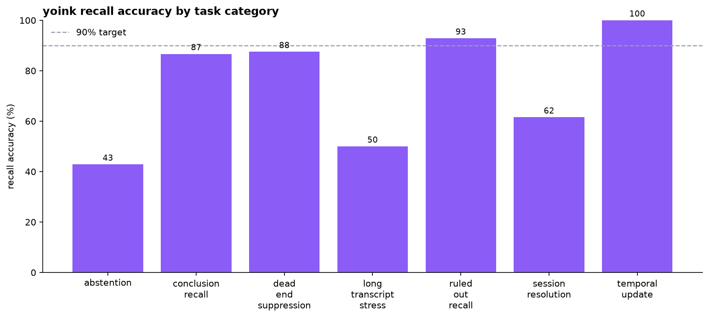
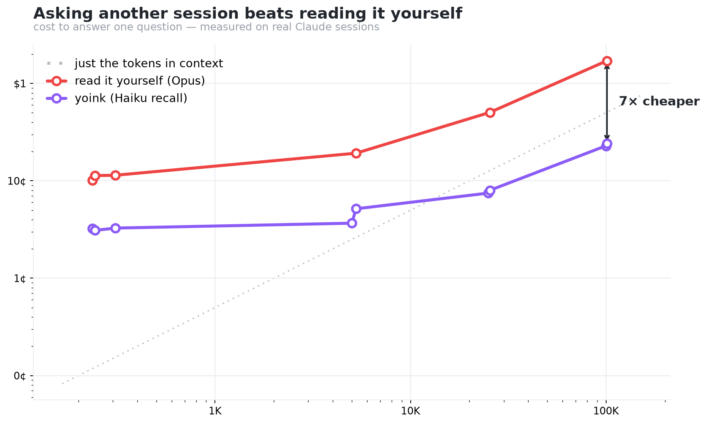
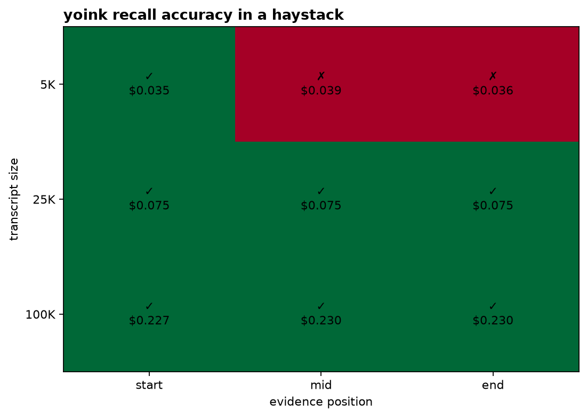

# Does yoink actually work — and is it cheaper?

Three questions, measured on **real Claude sessions** (built, resumed, and answered through the same
`claude -p --resume` path the product uses), not estimated:

1. **Does it recall the right answer?** → Track A
2. **Is it cheaper than the alternatives?** → Track B
3. **Does it hold up as sessions get big?** → Track C

Run it all: `uv run python benchmark/run.py` · watch progress from any terminal:
`uv run python benchmark/progress.py`.

## 1. Recall accuracy

100 fixtures across 7 task types. Each becomes a real session; yoink recalls it (Haiku) and a
keyword grader checks the answer. **"dead-end" = a ruled-out guess leaking into the answer.**



| Task type | What it tests | Accuracy | Dead-end leak |
|---|---|--:|--:|
| temporal_update | uses the latest decision, not the superseded one | **100%** | — |
| ruled_out_recall | lists what was abandoned | **93%** | — |
| dead_end_suppression | returns the ratified cause, not the dead ends | **88%** | **0%** |
| conclusion_recall | finds the final decision | **87%** | — |
| session_resolution | finds the right session from a fuzzy hint (among ~100) | 62% | — |
| long_transcript_stress | conclusion buried in a long, noisy session | 50% | **0%** |
| abstention | says "no conclusion" when the session never decided | 43% | — |
| **Overall** | | **75%** | **0%** |

**The headline is the differentiator, and it's clean:**

- **0% dead-end leak.** Across every fixture with a ruled-out guess, yoink *never once* reported the
  dead end as the answer. That's the entire premise of the product — *what a session decided, not
  everything it tried* — and it holds perfectly.
- **It never invents a conclusion.** Abstention **precision is 1.00** (F1 0.60, recall 0.43): when
  yoink *does* commit to an answer it's because the session reached one. The misses are the safe
  direction — it reports a leading-but-unconfirmed hypothesis instead of abstaining, never the
  reverse.
- **Perfect on recency** (100%) and strong on the core decision tasks (87–93%).

**Where it's weaker, honestly:** deeply-buried conclusions in long, noisy transcripts (50%) and
abstention *recall* (43%) drag the overall to 75%. Haiku tends to surface a plausible mechanism
rather than hold out for certainty. Both are real limitations, not rounding.

## 2. Cost & latency vs the alternatives

The same question answered four ways over 6 real sessions (small dead-end cases + 5K/25K/100K
haystacks). Every `claude` call reports its own `total_cost_usd` — measured, not modelled.

| Method | Accuracy ↑ | Dead-end leak ↓ | p50 latency ↓ | Cost/q ↓ | Live-context ↓ |
|---|--:|--:|--:|--:|--:|
| grep | 83% | 67% | **13 ms** | **$0.000** | 4,788 |
| read it yourself (Opus, full transcript) | 100% | 100% | 15.1 s | $0.456 | 22,102 |
| resume it yourself (Opus) | 100% | 50% | 8.4 s | $0.830 | 1,136 |
| **yoink (Haiku recall)** | 83% | **0%** | 11.0 s | **$0.078** | **1,022** |

**Everyone can find the answer. Only yoink doesn't hand you the dead ends with it.**

- **grep** is free and instant, but surfaces a ruled-out guess 67% of the time — it matches words, it
  can't tell *decided* from *abandoned*.
- **Reading or resuming the whole thing with Opus** finds the answer every time (100%) but **leaks the
  dead ends** (100% / 50% of the time) and costs **6–11× more** ($0.46–$0.83 vs $0.078).
- **yoink** answers for **$0.078**, hands back **~1,000 tokens** instead of dumping the 22,000-token
  transcript into your context, and is the **only method that never reports a dead end as the answer.**

By size, the cost gap widens: at **100K tokens**, reading it yourself costs **$1.71** vs yoink's
**$0.23** (~7×).



## 3. Long-context stress

A known conclusion buried in synthetic sessions from 5K to 100K tokens, at the start / middle / end,
with 0–10 distractors (one sample per cell).



- **Recall holds as the haystack grows.** At **25K and 100K** tokens, yoink found the buried
  conclusion in **every** position (start/middle/end). The two misses are at 5K — single-sample
  noise, not a size effect. Bigger, noisier context did not degrade recall.
- **Cost scales gently:** **$0.035 → $0.075 → $0.23** for 5K → 25K → 100K (20× the tokens, ~6× the
  cost — caching plus the cheap model).
- **Distractors don't fool it** (0, 3, 10 ruled-out alternatives at 25K all passed), and it **picks
  the updated decision over the superseded one** even buried at scale.
- **The one consistent miss is abstention** — the unanswerable haystack drew a confident answer, the
  same gap Track A found.

v1 caps at 100K, one sample per cell. 500K/1M and repeated sampling are deferred: a 1M-token session
is a ~$1 Opus-scale write just to build.

## Did it hit the bar?

The targets from [`STRATEGY.md`](STRATEGY.md) §2, and where v1 landed:

| Target | Result |
|---|---|
| ≤5% dead-end error rate | ✅ **0%** |
| high abstention precision (never invent) | ✅ **1.00** |
| ≥90% recall accuracy | ⚠️ **75%** overall (88–100% on core decision tasks; abstention-recall + buried long-context pull it down) |
| ≥3× lower cost than full transcript (medium) | ✅ **6×** ($0.078 vs $0.456) |
| ≥10× lower live-context than full transcript | ✅ **22×** (1,022 vs 22,102 tokens) |

## How it's measured (honestly)

- **Real sessions, real path.** Each fixture's user turns are replayed through `claude -p` to build a
  genuine on-disk session; recall runs the production `run_answerer` (`--resume --fork-session
  --tools "" --permission-mode plan`, Haiku). No inlined transcripts, no mocking.
- **Built sessions are cached** (`results/sessions.json`) so a re-run doesn't re-pay for them.
- **Real-model variance.** Recall runs on real model output, so numbers move a few points run to run;
  the grader keys on robust substrings to stay phrasing-tolerant.
- **Synthetic fixtures.** v1 is 100 hand-authored fixtures across the 7 STRATEGY categories. A corpus
  of real annotated sessions (STRATEGY v2) would be stronger; this is the honest v1 scope.

## Reproduce

```bash
uv run python benchmark/run.py                 # all three tracks + graphs, behind the live tracker
uv run python benchmark/recall.py              # Track A only
uv run python benchmark/costbench.py           # Track B only
uv run python benchmark/stress.py              # Track C only
uv run python benchmark/progress.py            # peek at progress from another terminal
```

Raw results land in `results/*.json`; graphs regenerate from them.

## What this is not

Not a coding-agent benchmark. yoink is a **read-only memory-recall layer** for Claude Code sessions —
it's measured on recall quality, cost, and context economy, not on writing patches.

## References

Benchmark design draws on: **LongMemEval** (long-term memory: extraction, temporal reasoning,
abstention), **LoCoMo** (conversational memory with evidence turns), **RULER** (long-context stress
beyond needle-in-haystack), **LOFT** (long-context vs retrieval, cost framing), **Mem0** (memory
benchmark on accuracy + tokens + p95 latency). Full rationale in [`STRATEGY.md`](STRATEGY.md).
