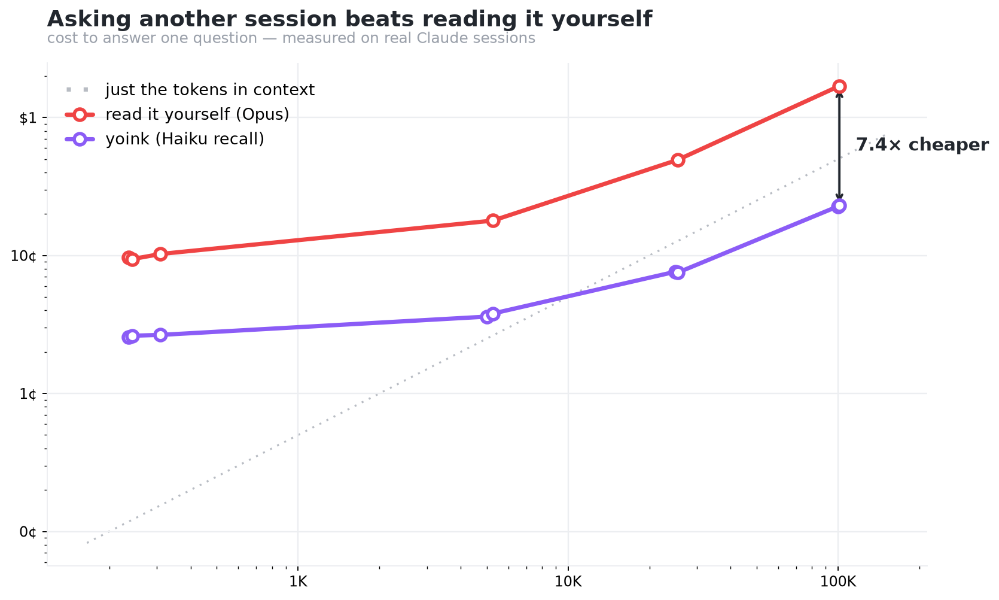
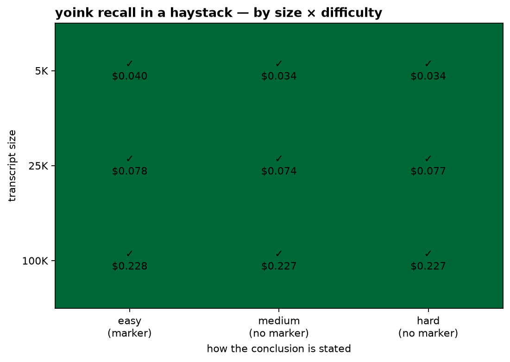

# Yoink Benchmark Metrics

Yoink is a **read-only recall layer for Claude Code sessions**. It helps you ask a previous session what it already figured out, without loading the entire transcript into your current context.

This benchmark therefore does **not** measure coding-agent performance. It measures whether Yoink can:

1. find the right prior session,
2. recover the conclusion that session reached,
3. avoid confusing abandoned dead ends with the final answer,
4. preserve useful “we already ruled this out” context,
5. save cost and live context compared with reading or resuming the full transcript.

Benchmark source: `benchmark/results/*.json`  
Latest reviewed benchmark commit: `1c3fa47`

---

## Headline results

| Metric | Result |
|---|---:|
| Overall prior-session recall accuracy | **89%** |
| Dead-end leak rate | **0%** |
| Latest-decision recall | **100%** |
| Ruled-out recall | **100%** |
| Long/noisy transcript recall | **85.7%** |
| Fuzzy session-resolution accuracy | **76.9%** |
| Abstention precision | **1.00** |
| Abstention recall | **0.78** |

In one sentence:

> On 100 real seeded Claude sessions, Yoink reached **89% prior-session recall accuracy** with **0% dead-end leak**, **100% latest-decision recall**, and **100% ruled-out recall**.

Cost/context result:

> On the cost benchmark, Yoink answered for about **$0.070/query**, roughly **6× cheaper** than full-transcript or native-resume Opus baselines, while returning about **908 live-context tokens** instead of **22K–42K**.

## Visual summary

<p align="center">
  
</p>

<p align="center"><em>Recall quality across the 100-session benchmark. The most important product-specific result is 0% dead-end leak: Yoink did not put ruled-out guesses in the answer.</em></p>

<p align="center">
  
</p>

<p align="center"><em>Yoink's main operational win is cost and context: about 6× cheaper and ~25× less live context than full-transcript reading on this benchmark.</em></p>

<p align="center">
  
</p>

<p align="center"><em>Long-context stress up to 100K tokens across easy, medium, and hard conclusion styles.</em></p>

---

## What “89% accuracy” means

The 89% number is **prior-session recall accuracy**, not general AI accuracy and not coding-task accuracy.

A benchmark item passes when Yoink does the right thing for that recall scenario, for example:

- returns the final conclusion,
- chooses the latest conclusion over an old superseded one,
- labels dead ends as ruled out instead of presenting them as the answer,
- finds the intended session from a vague hint,
- or safely handles an open/no-conclusion session.

The 100-fixture recall benchmark covers seven task types:

| Category | What it tests | Accuracy |
|---|---|---:|
| `temporal_update` | Uses the latest decision, not a superseded earlier guess | **100%** |
| `ruled_out_recall` | Lists abandoned paths as ruled out | **100%** |
| `dead_end_suppression` | Returns the ratified cause, not discarded guesses | **93.8%** |
| `conclusion_recall` | Finds the final decision | **93.3%** |
| `long_transcript_stress` | Finds a buried conclusion in long/noisy sessions | **85.7%** |
| `session_resolution` | Picks the right session from a fuzzy hint | **76.9%** |
| `abstention` | Handles true-open or tentative-hypothesis sessions safely | **71.4%** |
| **Overall** | Aggregate over all 100 fixtures | **89%** |

---

## Why dead-end leak is the most important safety metric

Search can find words. It cannot tell whether a word was the final answer or a failed hypothesis.

Example:

```text
Tried direct SSH. The firewall blocks it. Use the VPN instead.
```

A plain search for “access server” may show `SSH`, even though SSH was ruled out. Yoink should return:

```text
Answer: use the VPN
Ruled out: SSH
```

That is why the benchmark tracks **dead-end leak**:

> Did Yoink put a ruled-out guess into the answer field?

Current result:

```text
Dead-end leak rate: 0%
```

This is the strongest product-specific result. It shows Yoink is doing something more useful than keyword search: it distinguishes what the session **decided** from what it merely **tried**.

---

## Abstention: precision vs recall

Some sessions do not reach a firm conclusion. Others only reach a tentative hypothesis.

Yoink should not overclaim those as settled facts.

Current abstention metrics:

| Metric | Value | Meaning |
|---|---:|---|
| Abstention precision | **1.00** | When Yoink says the session did not settle, it is safe. |
| Abstention recall | **0.78** | Yoink still misses some cases where it should abstain or mark the answer as tentative. |
| Abstention F1 | **0.88** | Combined precision/recall score. |

How to say this publicly:

> Yoink has abstention precision **1.00** and recall **0.78** on no-conclusion/tentative cases.

Avoid saying:

> Yoink always knows when no conclusion was reached.

The current weakness is recall/tagging of open or tentative cases, not unsafe abstention behavior.

---

## Cost and live-context benchmark

This benchmark compares four ways to answer the same prior-session question.

| Method | Meaning |
|---|---|
| `grep` | Keyword search over the session JSONL. Fast, but does not answer. |
| `full-transcript` | Put the whole transcript into Opus and ask it to answer. |
| `native-resume` | Resume the old session manually with Opus and ask the question. |
| `yoink` | Yoink’s recall path using Haiku. |

Results over 6 real sessions:

| Method | Answer accuracy / evidence | Mean cost | Mean live context | p50 latency | Dead-end rate |
|---|---:|---:|---:|---:|---:|
| grep | evidence only | $0.000 | 48,310 tok | 11 ms | 100% |
| full-transcript Opus | 100% | $0.443 | 22,254 tok | 10.2s | 100% |
| native-resume Opus | 100% | $0.423 | 41,630 tok | 9.3s | 66.7% |
| Yoink Haiku recall | 100% | **$0.070** | **908 tok** | 15.5s | **0%** |

### Cost savings

| Comparison | Approximate saving |
|---|---:|
| Full transcript vs Yoink | **6.3× cheaper** |
| Native resume vs Yoink | **6.0× cheaper** |

By session size:

| Session size | Full transcript | Yoink | Ratio |
|---:|---:|---:|---:|
| ~5K tokens | $0.179 | $0.038 | **4.7×** |
| ~25K tokens | $0.493 | $0.075 | **6.6×** |
| ~100K tokens | $1.693 | $0.230 | **7.4×** |

The cost gap grows as the transcript gets larger.

### Live-context savings

“Live context” means how many tokens the user’s active session has to carry or inspect to get the answer.

| Method | Mean live context |
|---|---:|
| grep evidence | 48,310 tokens |
| native resume | 41,630 tokens |
| full transcript | 22,254 tokens |
| Yoink | **908 tokens** |

Yoink returns about:

- **24.5× less live context** than full transcript,
- **45.8× less live context** than native resume,
- **53.2× less text** than grep evidence output.

This is one of Yoink’s main usability benefits: the user gets a compact answer instead of dragging an entire old transcript into the current conversation.

### Latency

Yoink is **not faster** in this run:

```text
Yoink p50 latency:          15.5s
Full-transcript Opus p50:   10.2s
Native-resume Opus p50:      9.3s
```

The honest claim is:

> Yoink wins on cost and context, not latency.

---

## Long-context stress benchmark

Track C checks whether Yoink still works when the conclusion is buried in large sessions.

It tests three transcript sizes:

- 5K tokens,
- 25K tokens,
- 100K tokens.

And three conclusion styles:

| Difficulty | Description |
|---|---|
| Easy | Explicit `FINAL CONCLUSION:` marker |
| Medium | Natural prose, no marker |
| Hard | Conclusion implied across turns after correcting a dead end |

Current result:

| Size | Easy | Medium | Hard |
|---:|---:|---:|---:|
| 5K | pass | pass | pass |
| 25K | pass | pass | pass |
| 100K | pass | pass | pass |

Additional stress cells:

| Cell | Result |
|---|---:|
| Updated/superseded conclusion | pass |
| Unanswerable/no firm conclusion | pass |

Summary:

> Yoink passed the synthetic long-context stress suite up to 100K tokens across easy, medium, and hard conclusion styles.

Caveat: this track is synthetic and seeded. It tests size and difficulty knobs, but it is not a substitute for a large naturally occurring annotated session corpus.

---

## Metric-to-product-claim mapping

| Product claim | Metric | Current evidence |
|---|---|---|
| “Yoink recalls what the session decided.” | Overall recall + conclusion recall | 89% overall, 93.3% conclusion recall |
| “Yoink avoids dead-end confusion.” | Dead-end leak rate | 0% |
| “Yoink remembers what was ruled out.” | Ruled-out recall | 100% |
| “Yoink uses the latest decision.” | Temporal update | 100% |
| “Yoink can handle large sessions.” | Track C + long transcript category | Track C 100%; Track A long/noisy 85.7% |
| “Yoink is cheaper than reading the transcript.” | Mean cost | $0.070 vs $0.443 / $0.423 |
| “Yoink saves context.” | Mean live-context tokens | 908 vs 22K–42K |
| “Yoink avoids inventing conclusions.” | Abstention precision | 1.00 |
| “Yoink always knows when to abstain.” | Abstention recall | Not fully: 0.78 |
| “Yoink finds the right session from vague hints.” | Session resolution | Partial: 76.9% |

---

## Public wording guide

Good wording:

```text
Yoink reaches 89% prior-session recall accuracy on 100 real seeded Claude sessions,
with 0% dead-end leak, 100% latest-decision recall, and 100% ruled-out recall.
```

Good cost/context wording:

```text
Yoink answers for about $0.070/query on the cost benchmark, around 6× cheaper than
full-transcript or native-resume Opus baselines, while returning about 908 live-context
tokens instead of 22K–42K.
```

Good caveat:

```text
Yoink is just under the 90% recall target. The weakest areas are fuzzy session resolution
at 76.9% and no-conclusion/tentative tagging at 71.4% category accuracy.
```

Avoid:

```text
Yoink has 89% general accuracy.
Yoink always abstains correctly.
Yoink is faster.
grep gets 100% accuracy.
```

Better:

```text
Yoink has 89% prior-session recall accuracy.
Yoink has abstention precision 1.00 and recall 0.78.
Yoink is cheaper and uses far less live context; it is not faster in this run.
grep has evidence containment, but it does not answer and returns dead ends.
```

---

## Known weaknesses and next metrics

### 1. Session resolution

Current:

```text
session_resolution: 76.9%
```

Why it matters: if Yoink picks the wrong session, the answer may be irrelevant even if the recall prompt works.

Useful next metrics:

- top-1 session accuracy,
- top-3 contains intended session,
- disambiguation rate,
- wrong-high-confidence rate.

Target:

```text
session_resolution >= 85%
wrong-high-confidence rate near 0%
```

### 2. Abstention and tentative hypotheses

Current:

```text
abstention category accuracy: 71.4%
abstention precision: 1.00
abstention recall: 0.78
```

Why it matters: users need Yoink to distinguish settled conclusions from likely-but-unconfirmed hypotheses and open investigations.

Target:

```text
abstention precision stays 1.00
abstention recall >= 0.90
```

### 3. Human usability metrics

The current benchmark is automated. A future human/usability track should measure:

| Metric | Definition |
|---|---|
| Time to correct answer | Seconds from question to usable answer |
| Correction rate | % cases user says wrong session/answer |
| Follow-up rate | % answers needing clarification |
| Manual effort saved | Transcript lines/screens/tokens avoided |
| Confidence calibration | Whether confidence matches correctness |
| Dead-end confusion rate | Whether user would act on a ruled-out path |
| Session-pick accuracy | Whether selected session was intended |
| Answer compactness | Returned words/tokens |

Main usability KPI:

```text
Yoink reduces time-to-correct-answer by at least 3× while maintaining or improving correctness.
```

---

## Reproducing the benchmark

Run all tracks:

```bash
uv run python benchmark/run.py
```

Run individual tracks:

```bash
uv run python benchmark/recall.py
uv run python benchmark/costbench.py
uv run python benchmark/stress.py
```

Validate fixture structure and usage parsing:

```bash
uv run python benchmark/validate_fixtures.py
uv run python benchmark/usage.py --selftest
```

Raw results:

```text
benchmark/results/recall.json
benchmark/results/cost.json
benchmark/results/stress.json
```

Plots:

```text
benchmark/figures/accuracy.png
benchmark/figures/cost.png
benchmark/figures/stress.png
```
